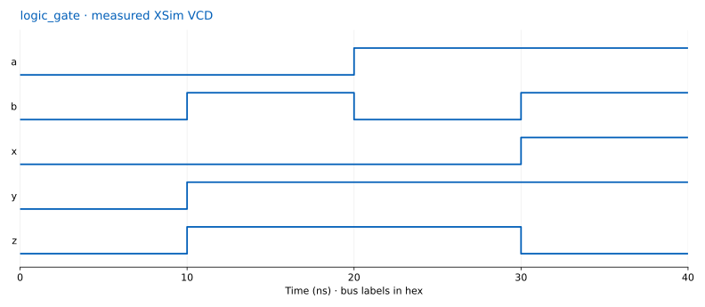

# AND OR XOR

[전체 프로젝트](../../README.md) · [설치](../../docs/setup.md) · [회로별 규칙](../../docs/circuits.md) · [강의 PDF](https://github.com/Glaysia/ece2_26_2_2/blob/daily/0910/weekly-slides/weekly-slides/LAB1_FPGA_0914/04.LAB1_11_LOGIC_GATES_LEGACY.pdf) · [실험 전·후 레포트](../../docs/reports.md)

## VS Code에서 먼저 실행

1. 별도 [템플릿](https://github.com/Glaysia/fpga-lab-template)을 clone합니다.
2. VS Code의 File → New Window → Open Workspace from File...에서 `legacy_01_logic_gates.code-workspace`를 엽니다.
3. Explorer에서 RTL과 `tb_logic_gate.sv`를 열고 예상 결과를 적습니다. File → Save All.
4. Terminal → Run Task... → **01 Check tools**, **02 Simulate** 순서로 실행합니다.
5. `LAB1_PASS logic_gate cases=4`와 정상 종료를 확인합니다.
6. **03 Open waveform** → VaporView → `tb_logic_gate` 신호 추가 → Zoom to Fit → 커서 값을 예상값과 비교합니다.
7. `build/vscode/simulation.log`, `wave.vcd`, 자신의 화면 캡처와 해석을 실험 전 레포트에 남깁니다.

## 프로젝트 입력

[VS Code workspace](legacy_01_logic_gates.code-workspace) · [Vivado 프로젝트](vivado/logic_gate.xpr) · [재생성 Tcl](create_project.tcl)

[같은 회로의 다른 버전](../../vivado_2026_1/01_logic_gates/README.md) · [통합 모드 01](../../docs/integrated.md#mode-01)

- FPGA: `xc7s75fgga484-1`
- 설계 top: `logic_gate` / 시뮬레이션 top: `tb_logic_gate`
- [자기검사 TB](../../common/tb/tb_logic_gate.sv) / [핀 제약](../../common/constraints/logic_gate.xdc) / [파일 목록](sources.f)
- [logic_gate.v](original/logic_gate.v)

원본 XPR은 Vivado 2020.1 형식입니다. 현재 제작 환경의 XSim 2026.1로 RTL을 검사했으며, Vivado 2020.1 GUI 실행·합성은 수행하지 않았습니다. `original/`은 원본이고 `vivado/`의 XPR은 상대경로로 정리한 실습용입니다.

## Vivado 실습

레거시는 `vivado/logic_gate.xpr`을 원래 버전에서 엽니다. 최신 버전은 PDF의 New Project 절차를 따라 `xc7s75fgga484-1`를 선택합니다. Add Sources에서 RTL은 Design Sources, TB는 Simulation Sources, XDC는 Constraints로 각각 추가하고 Copy sources 옵션을 끕니다. 설계와 시뮬레이션 top을 각각 확인합니다.

Run Simulation → Run Behavioral Simulation에서 PASS·파형을 확인합니다. Close Simulation → Run Synthesis → Run Implementation → Generate Bitstream을 차례로 완료합니다. 단계별 Launch Runs에서 OK를 누르고 성공 창이 뜨기 전에는 다음으로 진행하지 않습니다. 생성 파일은 `vivado/logic_gate.runs/impl_1/logic_gate.bit`입니다.

Open Hardware Manager → Open target → Auto Connect → 장치 확인 → Program Device → bit 선택 → Program. 실제 보드 입력을 바꾸고 사진·영상을 촬영한 뒤 실험 후 레포트에서 연결합니다.

## 제작 검증

[실행 결과와 소스 SHA-256](evidence/validation.json): VS Code 단계 **PASS**, Vivado 시뮬레이션 **NOT_RUN**, Vivado bit 생성 **NOT_RUN**. 이는 제작 환경의 실행 기록이며 자신의 실행 증빙을 대신하지 않습니다. CLI 프로젝트는 [별도 검증](../../docs/cli.md)을 봅니다.

실제 보드 기록·사진·영상은 **미수행**입니다. 생성된 bit만으로 보드 실험 완료를 주장하지 않습니다.

## 실제 VCD 구간

위 그림은 실제 VCD 값으로 그린 타이밍 도표이며 VS Code 화면 캡처는 아닙니다. [원본 VCD](evidence/waveform-source.vcd) · [구간·신호·해시](evidence/waveform-plot.json). 다중 비트 표시는 16진수입니다.
